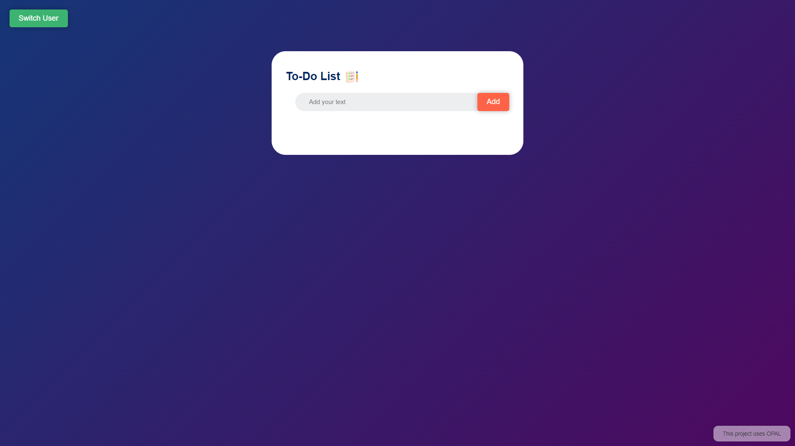

# To-do-list-OPAL


# 📝 To-Do List App ✅

Welcome to the To-Do List App! 📅 This application allows users to manage tasks with role-based permissions. Users can log in as either admin or guest to add and delete tasks.

## 🌟 Features

- ✍️ **Add Tasks**: Users can add tasks to the list.
- 🗑️ **Delete Tasks**: Admins can delete tasks; guests can mark tasks as completed.
- 📈 **Role-Based Permissions**: Different permissions for admin and guest roles.
- 📥 **Data Persistence**: Tasks are saved locally and restored on page reload.

## 📸 Screenshots



## 📷 Demo

[](https://www.youtube.com/watch?v=YnHYYVFkBlQ)


## 🛠️ Technologies Used

- ⚛️ **HTML**
- 🎨 **CSS**
- 📜 **JavaScript**
- 📦 **LocalStorage** (for data persistence)
- 🛡️ **Policy Management** (OPAL integration)

## 📦 Installation

1. Clone the repository:
    ```bash
    git clone https://github.com/sharmachaitanya945/to-do-list-OPAL.git
    ```
2. Navigate to the project directory:
    ```bash
    cd to-do-list-OPAL
    ```
3. Open `index.html` in your preferred web browser.

## 🚀 Usage

1. **Login**: Upon opening the application, log in as either "admin" or "guest".
2. **Add Task**: Enter a task in the input box and click "Add".
3. **Manage Tasks**:
   - Admin: Click the delete (✕) button to delete tasks.
   - Guest: Click a task to mark it as completed.
4. **Switch User**: Click the "Switch User" button to toggle between admin and guest roles.
5. **Data Persistence**: Tasks are saved locally and restored on page load.

## 🔑 Policy Management

This application uses OPAL for policy management. Ensure your OPAL server is configured correctly for role-based access control.

## 📜 License

This project is licensed under the MIT License.

## 🙌 Acknowledgements

- 🛡️ [OPAL](https://docs.opal.ac/) for policy management.
- 🎨 Icons made by [Freepik](https://www.freepik.com) from [www.flaticon.com](https://www.flaticon.com).

## 🤝 Contributing

Contributions are welcome! Open an issue or submit a pull request for any improvements or suggestions. Let's make this app even better together! 🌟
